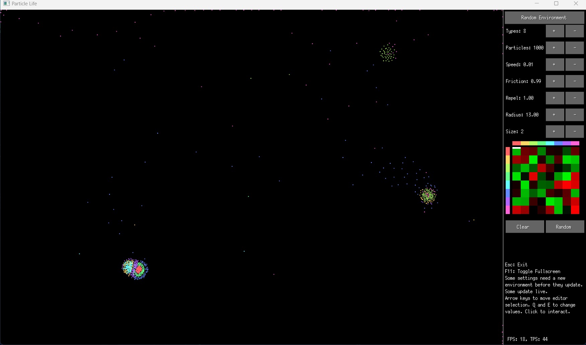
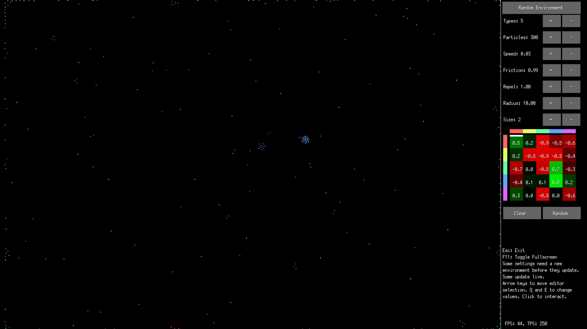

# Particle Life

A particle life simulation, written in Go.

Different particles are attracted or repelled from each other, resulting in interesting emergent dynamics.

Feel free to download it from the releases page.

---

 
 

<b>Larger simulation.</b>
 
 

 
 

<b>Smaller simulation.</b>
 
 

